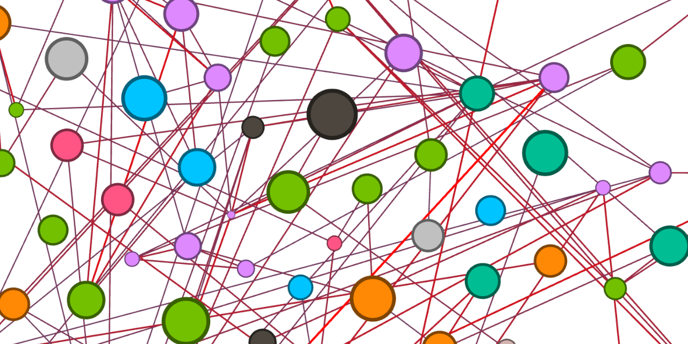

# Time Table Planner

This repository is not a complete or usable product and should only be used as a reference for other projects.

It parses fuzzy ocr-scanned course lists and connects them with a non-fuzzy list of all students.
With this information it creates personalized time tables for each student and a map of the entire student body.
It supports [gephi](https://gephi.org/).
This map shows all the connections between the students, i.e. how many hours they spend in the same room.
Such kind of visualization can for example be used to select appropriate pandemic containment plans.

It has been created to prove that a simple python program can be used to produce this this kind of data.

## Privacy

To ensure the privacy of the students the input and output data used to test this project is not contained within this repository.
Therefore you can't easily test this program yourself.
Sorry🙁

